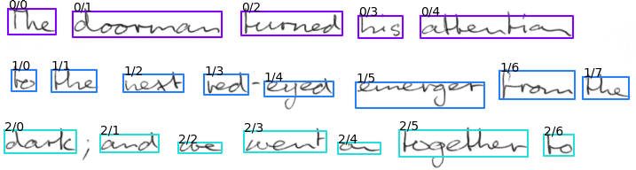
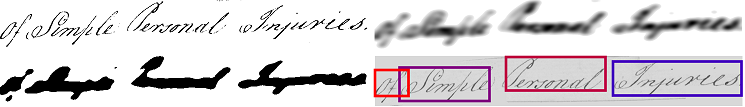
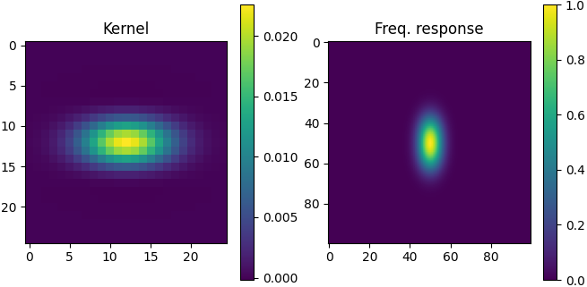
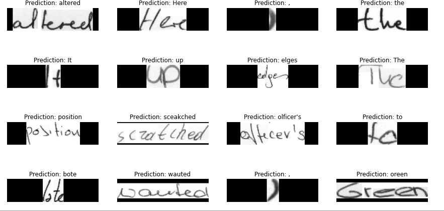

# Optical Character Recognition

This repository implements the scale space technique for word segmentation as proposed by [R. Manmatha and N. Srimal](http://ciir.cs.umass.edu/pubfiles/mm-27.pdf). Despite being introduced in 1999, this method remains highly effective, offering excellent results with a simple and fast implementation.

The algorithm takes an **image containing text** as input and **outputs detected words**. Additionally, it can sort words according to the reading order (top to bottom, left to right).



---

## Installation

1. Clone the repository and navigate to the root directory.
2. Install the package:
   ```bash
   pip install .
   ```
3. Run tests to confirm installation:
   ```bash
   cd tests
   pytest
   ```

---

## Usage

Here is an example of how to use the package:

```python
from word_detector import prepare_img, detect, sort_line
import matplotlib.pyplot as plt
import cv2

# Step 1: Prepare the image
# (a) Convert to grayscale
# (b) Scale to a specific height as the algorithm is not scale-invariant
img = prepare_img(cv2.imread('data/line/0.png'), 50)

# Step 2: Detect words in the image
detections = detect(img,
                    kernel_size=25,
                    sigma=11,
                    theta=7,
                    min_area=100)

# Step 3: Sort words in a single line
line = sort_line(detections)[0]

# Step 4: Visualize the detected words
plt.subplot(len(line), 1, 1)
plt.imshow(img, cmap='gray')
for i, word in enumerate(line):
    print(word.bbox)
    plt.subplot(len(line), 1, i + 2)
    plt.imshow(word.img, cmap='gray')
plt.show()
```

### Running Examples

The repository includes examples demonstrating the package usage:

1. Install the required dependencies:
   ```bash
   pip install -r requirements.txt
   ```
2. Run the examples:
   ```bash
   cd examples
   python main.py
   ```
   This will detect words in line images from the IAM dataset.

3. To process a page image:
   ```bash
   python main.py --data ../data/page --img_height 1000 --theta 5
   ```

---

## Package Functions

The package provides the following key functions:

- **`prepare_img`**: Prepares the input image for word detection by converting it to grayscale and resizing.
- **`detect`**: Detects words in the image using the scale space technique.
- **`sort_line`**: Sorts detected words within a single line.
- **`sort_multiline`**: Clusters words into lines and sorts them individually.

For more details on each function and their parameters, use Python's `help` function. Example:
```python
help(detect)
```

---

## Algorithm Overview

The illustration below provides an overview of the algorithm:

1. **Top Left**: Input image
2. **Top Right**: Apply the filter to the image
3. **Bottom Left**: Threshold the filtered image
4. **Bottom Right**: Compute bounding boxes for the words



### Filter Kernel Details

The kernel models the typical shape of a word, with a width larger than the height (e.g., aspect ratio of 3:1). Below are the kernel (left) and its frequency response (right):



---

## Selecting Parameters

The algorithm is **not scale-invariant**, so proper parameter selection is crucial. Here are some guidelines:

1. **Text Height**:
   - Default parameters work well for text heights between 25-50 pixels.
   - Resize line images to ~50 pixels height.
   - Resize page images so that words are between 25-50 pixels in height.

2. **Sigma (`sigma`)**:
   - Controls the width of the Gaussian filter along the x-direction.
   - Small values may cause over-segmentation (multiple detections per word).
   - Large values may result in under-segmentation (multiple words in one detection).

3. **Kernel Size (`kernel_size`)**:
   - Should be large enough to encompass most non-zero values of the Gaussian filter.

4. **Theta (`theta`)**:
   - Represents the average aspect ratio (width/height) of words.

### Parameter Optimization

Use a dataset (e.g., IAM) and an evaluation metric (e.g., Intersection over Union) to fine-tune parameters for optimal performance.

---

## Output Sample

Here is an example of the output generated by the algorithm:



